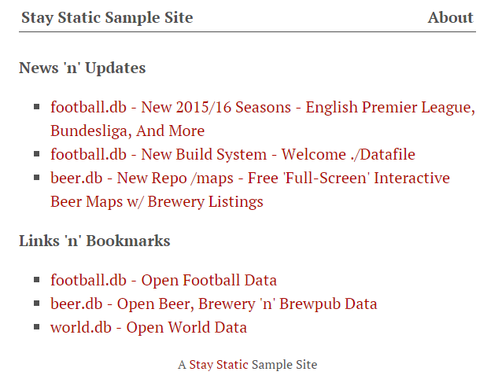

# {{ page.title }}

Contents:

* [What's Stay Static?](#whatis)
* [Static Site Samples](#samples)
* [Contributions Welcome](#contributions)
* [License](#license)
* [Questions? Comments?](#questions)

## What's Stay Static?  {#whatis}

Interested in static site builders / generators?
The Stay Static Series presents the world's greatest static site builders / generators in action.

The sample site showcases:
    
1. Posts
2. Pages
3. Custom Content Types (e.g. Bookmarks 'n' Links)

## Static Site Samples  {#samples}

_Ruby_

**Jekyll** - [Sample Site](http://staystatic.github.io/sites/jekyll), [Source](https://github.com/staystatic/jekyll)

**webgen** - [Sample Site](http://staystatic.github.io/sites/webgen), [Source](https://github.com/staystatic/webgen)

_Go_

**Hugo** - [Sample Site](http://staystatic.github.io/sites/hugo), [Source](https://github.com/staystatic/hugo)

<!--
_JavaScript_

**Metalsmith** - [Sample Site](http://staystatic.github.io/sites/metalsmith), [Source](https://github.com/staystatic/metalsmith)
-->

## Contributions Welcome  {#contributions}

Is your static site builder / generator missing? Contributions welcome!
Send in your pull requests / repos.

## License  {#license}

The static site samples are dedicated to the public domain. 
Use it as you please with no restrictions whatsoever.

## Questions? Comments?   {#questions}

Send them along to the [wwwmake forum / mailing list](http://groups.google.com/group/wwwmake). Thanks!

